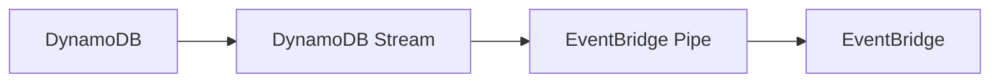
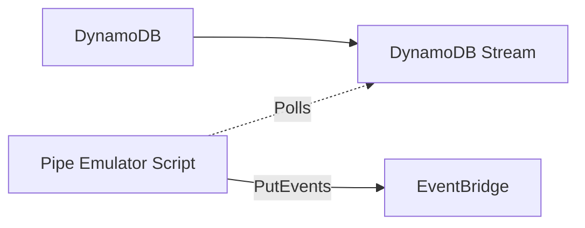

# DynamoDB CDC Event Stream Example

This example shows use of DynamoDB, DynamoDB Streams, Event Bridge Pipes, and Event Bridge, to create a CDC (Change Data Capture) system. The entities in DynamoDB correspond to the entity_x JSON Schema. The CDC message detail property is a JSON document which corresponds to the cdc_x JSON Schema.

## Getting Started

### Prerequisites

This project uses [Bun](https://bun.sh/) as the runtime and package manager. It also relies on Podman and `docker-compose` for local infrastructure.

1. **Podman**: Install via the official installer (NOT Homebrew) to ensure proper setup.
   - Download from [podman.io](https://podman.io/docs/installation).
   - Follow the instructions to initialize the Podman machine.

2. **Docker Compose**: Install the Go-based utility via Homebrew. This allows `docker-compose` commands to interact with the Podman socket:

   ```bash
   brew install docker-compose
   ```

3. **Bun**: To install Bun (macOS/Linux):
   ```bash
   curl -fsSL https://bun.sh/install | bash
   ```
   After installation, you may need to manually add the following to your `~/.zshrc`:
   ```bash
   export BUN_INSTALL="$HOME/.bun"
   export PATH="$BUN_INSTALL/bin:$PATH"
   ```
   Then restart your terminal or source your profile (e.g., `source ~/.zshrc`) to apply the changes.

# AWS Solution Architecture



[!Note]
The EventBridge Pipes are not available in the LocalStack Community Edition, so for local development we use a local script to emulate the pipe behavior (forwarding Stream records to the Bus). See the steps below for more details.



## Running Locally - Quickstart

This project uses **LocalStack** to emulate AWS services locally.

### Quickstart

To quickly spin up the local infrastructure, bootstrap resources, and **start the API server**, run:

```bash
bun run local:init
```

Next, as we're using the local pipe emulator, open a new terminal, and run:

```bash
bun run local:pipe
```

This will poll the DynamoDB stream and forward events to the EventBridge bus.

Finally, in a new terminal, you can test the API by running the following:

```bash
bun run test:integration
```

## Running Locally - Step-by-Step

### 1. Start Infrastructure

Start LocalStack using Docker Compose:

```bash
bun run infra:up
```

_Note: Ensure you have Docker or Podman running._

### 2. Bootstrap Resources

Create the DynamoDB table, EventBridge bus, and other resources:

```bash
bun run bootstrap
```

### 3. Start Local Pipe Emulator

Since LocalStack Community Edition does not support EventBridge Pipes, we use a local script to emulate the pipe behavior (forwarding Stream records to the Bus). Run this in a **separate terminal**:

```bash
bun run local:pipe
```

### 4. Start the Application

Run the Hono API server in another **separate terminal**:

```bash
bun run dev
```

### 5. Run Integration Test

Run the end-to-end integration test. This script will PUT an item to the API and verify that it lands in DynamoDB and triggers a CDC event (verified via a debug SQS queue):

```bash
bun run test:integration
```

### 6. Observing the Flow

When you run the test (or use `curl`), you can observe the system in action:

- **API Terminal** (`bun run dev`): You will see the incoming `PUT /entity-x/:id` request logs.
- **Pipe Emulator Terminal** (`bun run local:pipe`): You will see logs indicating it found records in the stream and forwarded them ("Events sent to Bus").
- **Integration Test Output**: Prints the confirmed flow: "PUT OK", "DDB OK", and displays the received CDC JSON payload from the SQS queue.

### Cleanup

To stop and remove the LocalStack containers:

```bash
bun run infra:down
```
